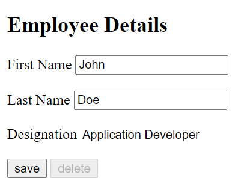

# UI Security

ui-security is a Javascript library for securing frontend elements based on user or role configuration.

# Introduction

## Installation

Use the package manager [npm](https://www.npmjs.com/package/ui-security) to install.

```bash
npm i ui-security
```

## Usage

Step1: load the secuirty data during app initialization.

```js
import loadSecurity from "ui-security";

loadSecurity(securityParam, dataMap, optionalParam);
```

Step2: get the secuirty data to hide/disable HTML elements on page.

```js
import getSecurity from "ui-security";

getSecurity(elementId);
```

# Parameters

1. securityParam: {type: object}(default null). This parametery is required. pass the valid URL and payload required to fetch the security details from the backend server. Internally these values are passed to fetch request .
   For example:

```js
{
  url: "http://example.com/getSecurityData",
  payload: {
    method: "GET",
    headers: headers,
  },
}
```

2. dataMap: {type: object}(default null). This parametery is required. provide the keyAttribute and valueAttribute in response object. These values are stored in security cache as key-value pair.

```js
{
  keyAttribute: "id",
  valueAttribute:"access"
}
```

3. optionParam: {type: object}(default null). This parametery is optional.This is provided for future extension.

# sample response

For example as per below configuration Desigation in readoly , Delete button is disabled and Cancel button is hidden for the user.

```
[
  {
    "id": "designation-input",
    "access": ""
  },
  {
    "id": "delete-btn",
    "access": "disabled"
  },
  {
    "id": "cancel-btn",
    "access": "hidden"
  }
]
```



## Contributing

Suggestion are more than welcome, not only for feature requests but also for coding style improvements. Let's make this a great library to make people's lives easier!

Please make sure to update tests as appropriate.

## License

[MIT](https://choosealicense.com/licenses/mit/)

```

```
