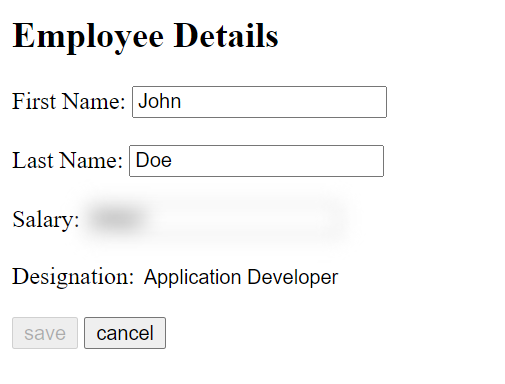

# UI Security

ui-security is a Javascript library for securing frontend elements based on user or role configuration.

# Introduction

## Installation

Use the package manager [npm](https://www.npmjs.com/package/ui-security) to install.

```bash
npm i ui-security
```

## Usage

Step1: load the secuirty data during app initialization.

```js
loadSecurity(securityParam, dataMap, optionalParam);
```

Step2: apply secuirty for a page to hide/disable HTML elements on page.

```js
applySecurity(pageId);
```

# Parameters

1. **securityParam:** {type: object}(default null). This parameter is required. pass the valid URL and payload required to fetch the security details from the backend server. Internally these values are passed to fetch request .

payload object containing any custom settings that you want to apply to the request.

- https://developer.mozilla.org/en-US/docs/Web/API/Request/Request
  
  For example:

```js
{
  url: "http://example.com/getSecurityData",
  payload: {
    method: "GET",
    headers: headers,
  },
}
```

2. **dataMap:** {type: object}(default null). This parameter is required. provide the key attribute and value attribute in response object. These values are stored in security cache as key-value pair.

```js
{
  key: "id",
  value:"access"
}
```

3. **optionParam:** {type: object}(default null). This parameter is optional.This is provided for future extension.

# sample response

For example as per below configuration Desigation in readOnly , Delete button is hidden and save button is disabled and salary is blurred.

```
[
  {
    "id": "designation-input",
    "access": "readOnly"
  },
  {
    "id": "save-btn",
    "access": "disabled"
  },
  {
    "id": "delete-btn",
    "access": "hidden"
  },
  {
    "id": "salary-input",
    "access": { "filter": "blur(6px)" }
  }
]

```



## Contributing


## License

[MIT](https://choosealicense.com/licenses/mit/)
